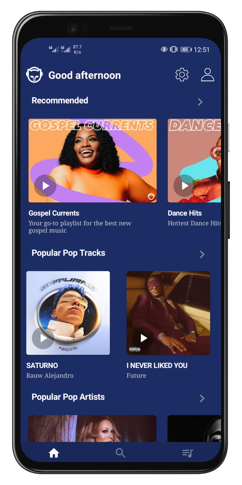
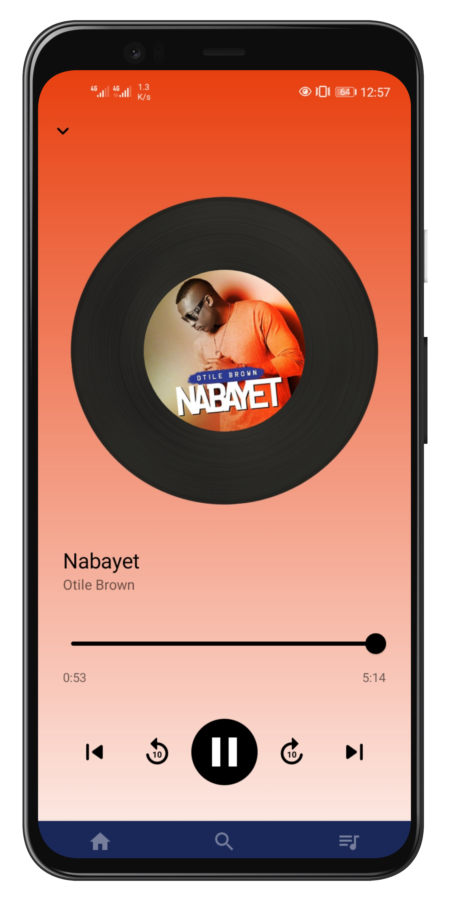
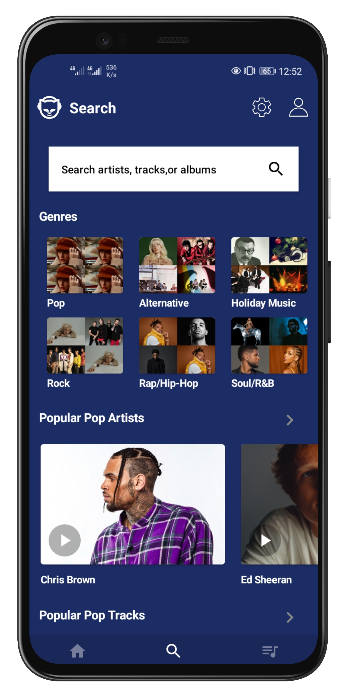
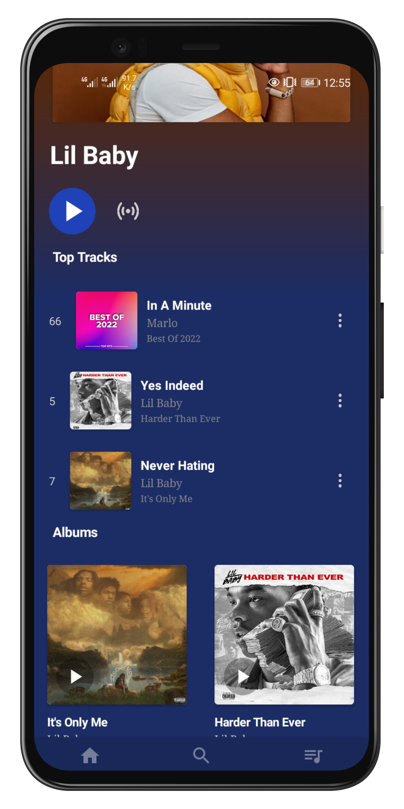
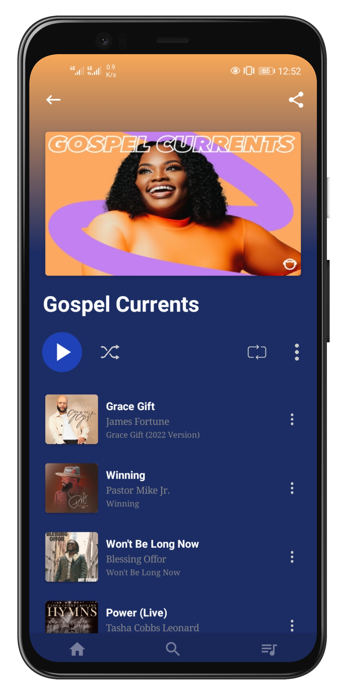
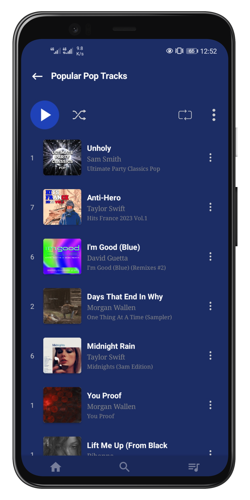
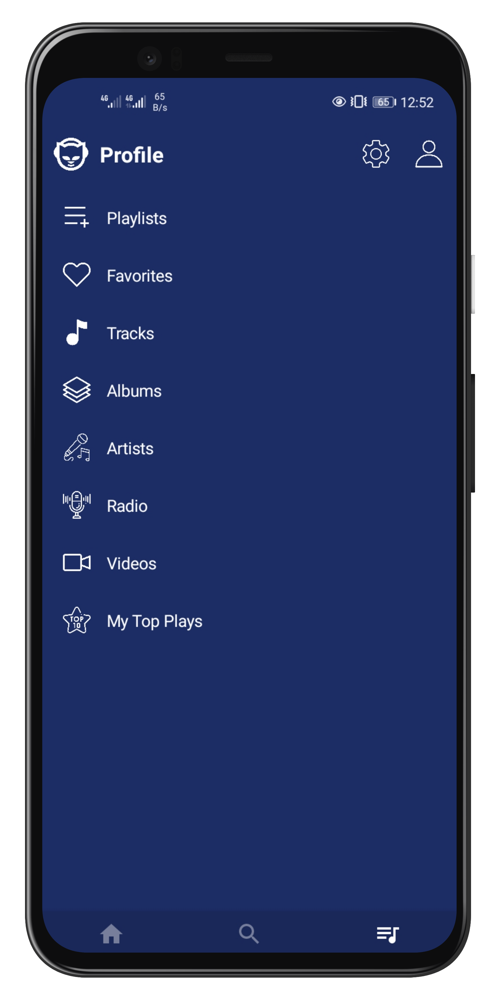
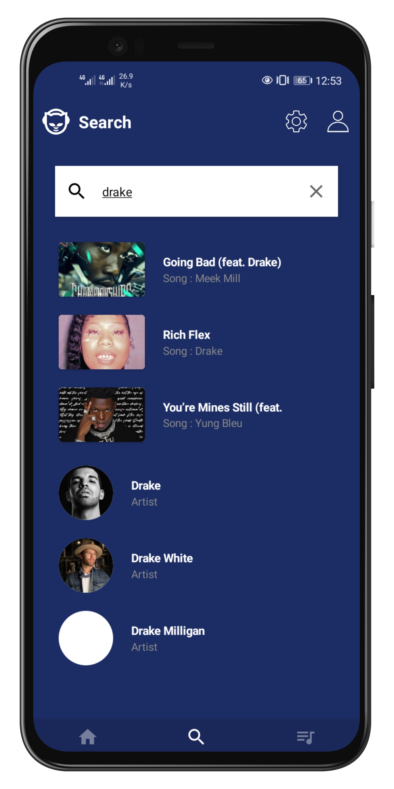

<h1 align="center">
 
  
 
 
Music player app built with Kotlin
</h1>

  
  
  
  
  
  
  

 

| HOME | Player | Search | Predictions |
| ------ | ----- | ------ | ----- |
|  |  |  |  |

| Matches | Live | News | Info |
| ------ | ----- | ------ | ----- |
|  |  |  |  |

  

API https://www.themoviedb.org/documentation/api

Kotlin: https://kotlinlang.org/docs/reference/

Data binding: https://developer.android.com/topic/libraries/data-binding/

RxJava 2, RxAndroid: https://github.com/ReactiveX/RxJava

Coroutines: https://kotlinlang.org/docs/reference/coroutines.html

Retrofit 2: https://github.com/square/retrofit

Moshi: https://github.com/square/moshi

Glide: https://github.com/bumptech/glide

Dagger-Hilt: https://developer.android.com/training/dependency-injection/hilt-android

Android X: https://developer.android.com/topic/libraries/support-library/androidx-overview

===> Android Architecture Component

Lifecycle: https://developer.android.com/topic/libraries/architecture/lifecycle

View Model: https://developer.android.com/topic/libraries/architecture/viewmodel

Live data: https://developer.android.com/topic/libraries/architecture/livedata.html

Room: https://developer.android.com/topic/libraries/architecture/room.html

Navigation: https://developer.android.com/guide/navigation

Architecture: https://github.com/googlesamples/android-architecture-components

<===
